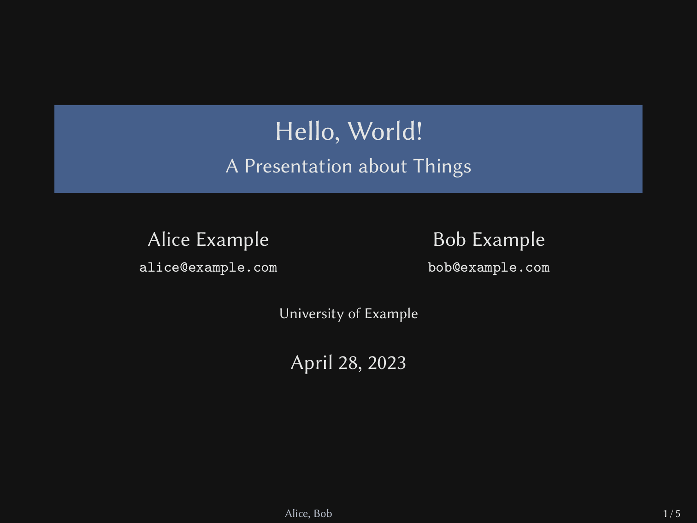
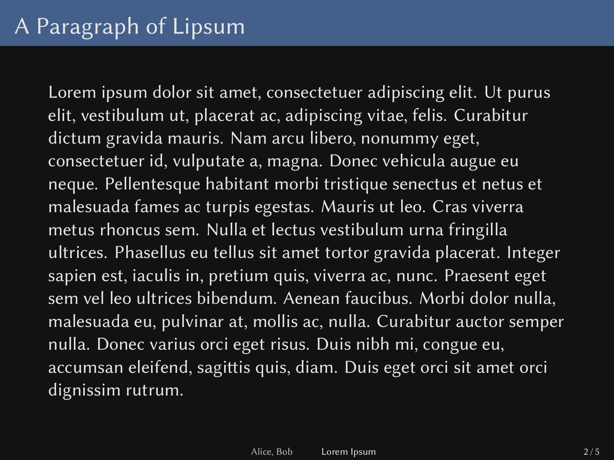
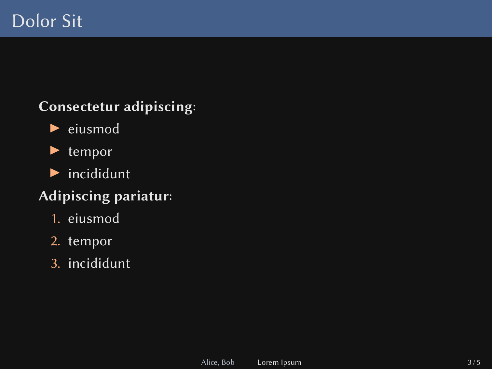
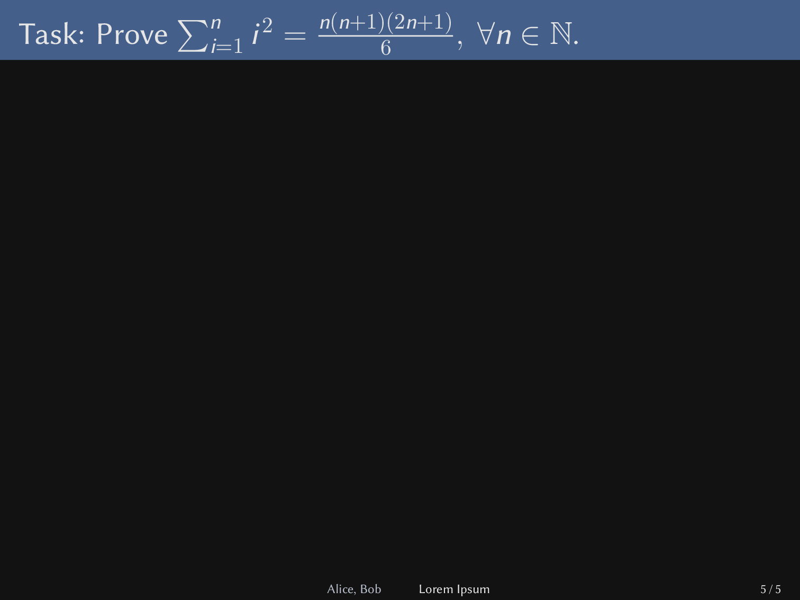

# cknopmpf

/knɔmpf/ is a beamer theme.

## install

Symlink the `.sty` to `~/texmf/tex/latex/cknopmpf/cknopmpf.sty`.

## options

`german`:  Use German language instead of English.  Loads `ngerman`
babel and uses German labels for custom environments.

`light`:  Switches the theme from dark to light.  Note that cknopmpf is
is primariliy a dark theme, so this option makes your slides
printer-friendly but ugly.

## features

*Blackboard Slides* are slides that only have a title but their content
is blank.  They are indented to be drawn on during a lecture.
Create blackboard slides with the `\blackboardframe{Example Title}`
command.

You might wish to share a version of your slides without these
blackboard slides, so they must explicitly be enabled with the
`\enableblackboardframes` command.

## example

